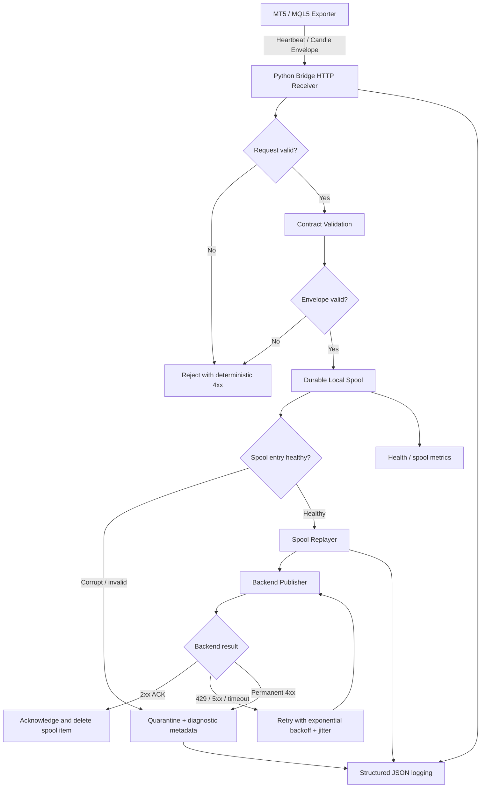
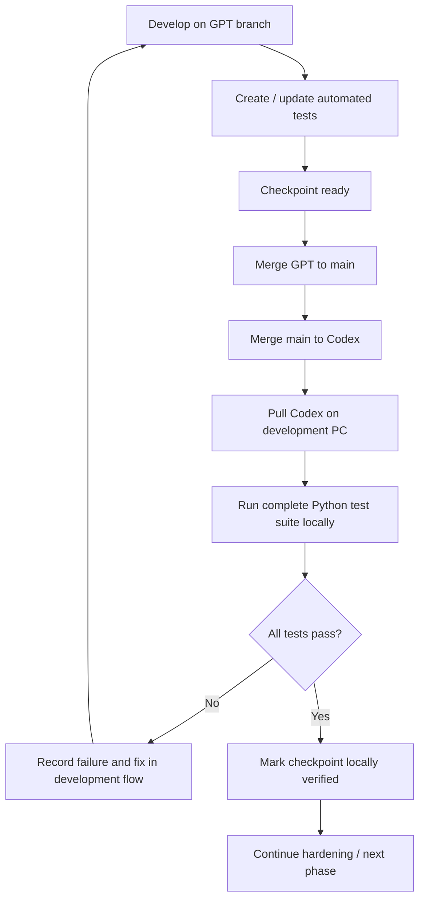

# Phase 02 — Python Bridge Workflow

## Purpose

This document describes how the Python MT5 Bridge moves market data safely from the MT5-side exporter toward the backend, how failures are handled, and how the bridge is verified before real MT5/server integration.

## Runtime flow

## Reliability rules

1. An accepted candle envelope is persisted to the local spool before it is considered safely queued.
2. A spool item is removed only after downstream acknowledgement (ACK-driven removal).
3. Transient failures such as timeout, HTTP 429, and HTTP 5xx are retried with bounded exponential backoff and jitter.
4. Permanent backend rejection is quarantined so a poison message cannot block the FIFO forever.
5. Corrupt or malformed spool files are quarantined automatically and do not block healthy pending entries.
6. Duplicate batch IDs are idempotent when content is identical; conflicting reuse is rejected.
7. Reused source sequence values with conflicting pending content are rejected.
8. Spool capacity is bounded by item count and bytes. Full capacity rejects new data rather than silently deleting older accepted data.
9. Health exposes spool depth/capacity/utilization/disk availability/quarantine depth and terminal heartbeat state.
10. Structured logs must not contain raw credentials, authorization headers, tokens, passwords, API keys, secrets, or connection strings.

## Current pre-server testing flow

Until the real Linux collector/server and real MT5 environment are ready, verification uses the simulator, fake backend behavior, durable spool, and automated Python tests.

## Branch responsibility

- `GPT`: active development performed through ChatGPT.
- `main`: shared integration/junction branch. Development checkpoints must pass through `main`.
- `Codex`: PC/IDE-facing branch used for Codex-assisted local verification and development handoff.

Canonical synchronization path:

`GPT -> main -> Codex -> local PC testing`

Direct `GPT -> Codex` synchronization should not be used for normal checkpoints.

## Test checkpoint expectations

A checkpoint is not considered PASS merely because test files exist. It becomes locally verified only after the test suite is executed on the development PC and the result is reviewed.

The Python test suite covers contract validation, heartbeat/health behavior, durable spool semantics, duplicate and sequence safety, restart/recovery behavior, backend publishing classification, ACK-driven removal, retry behavior, quarantine behavior, and structured logging/secret redaction.

## Deferred real-environment validation

The following remain deferred until the Linux collector/server and real MT5/Wine environment are available:

- Real broker symbol suffix/prefix discovery.
- Real M15/H1/H4 candle comparison against broker charts.
- Real tick freshness and spread comparison.
- Broker/server timezone and DST validation.
- Terminal disconnect/reconnect behavior under Wine.
- Broker historical backfill depth.
- Account/terminal telemetry comparison.

## Exit condition

When all non-deferred automated and local tests pass, the Python Bridge can be marked **Ready for Real MT5 Integration**. That status does not mean the whole AI Forex system is production-ready; real MT5, .NET ingestion, persistence, AI/news/risk layers, and end-to-end deployment remain separate integration phases.
