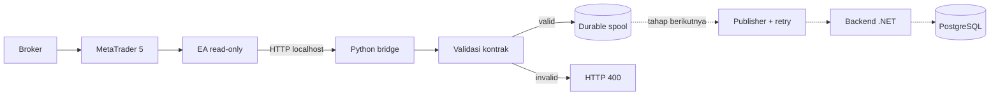
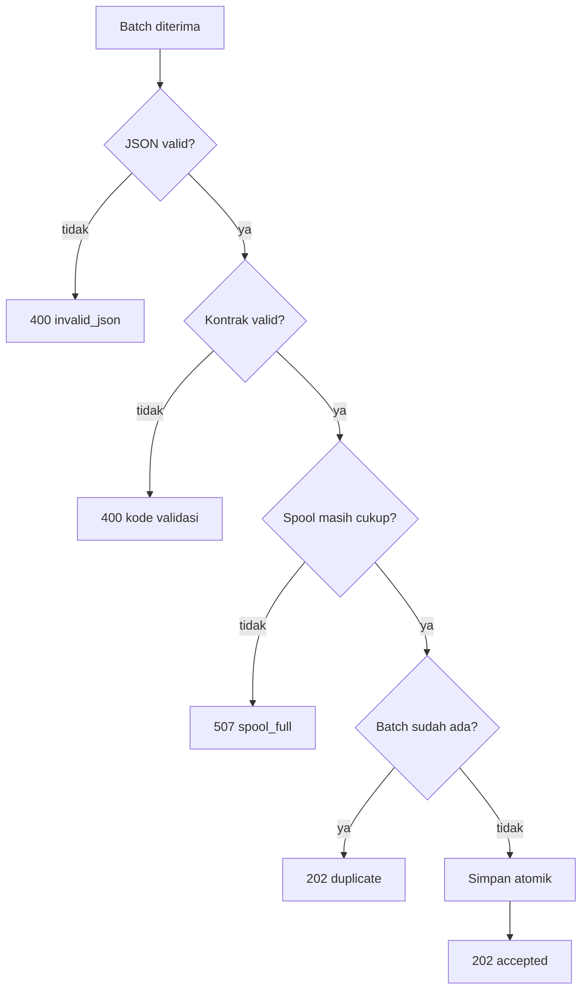

# Alur MT5 Bridge

Dokumen ini menjelaskan tugas `mt5-bridge` dengan bahasa sederhana. Bridge adalah perantara
lokal antara Expert Advisor (EA) di MetaTrader 5 dan backend Forex Intelligence. Bridge hanya
membawa data pasar dan tidak mempunyai fungsi untuk membuka, mengubah, atau menutup order.

## Gambaran besar



Garis penuh menunjukkan bagian yang sudah tersedia. Garis putus-putus menunjukkan bagian
yang belum diimplementasikan.

## Alur yang sudah bekerja

### 1. EA mengirim data ke localhost

EA mengirim request hanya ke bridge yang berjalan pada `127.0.0.1`. Ada dua endpoint:

- `POST /v1/mt5/heartbeat` untuk membuktikan EA dapat menjangkau bridge.
- `POST /v1/mt5/envelopes` untuk mengirim batch candle versioned.

Bridge sengaja tidak boleh dibuka ke LAN atau internet. Komunikasi keluar menuju backend
nantinya menjadi tanggung jawab publisher terpisah.

### 2. Receiver membatasi request

Sebelum membaca JSON, receiver memastikan ukuran body berada dalam batas 64 KiB. Request
kosong atau terlalu besar langsung ditolak sehingga tidak menghabiskan memory tanpa batas.

### 3. Validator memeriksa envelope

Satu envelope mewakili satu batch yang bisa dikirim ulang dengan aman. Validator memeriksa:

- schema harus `mt5-envelope.v1`;
- payload harus bertipe `CANDLES`;
- `batchId` harus berbentuk ULID;
- `sequence` tidak boleh negatif;
- batch berisi 1–100 record;
- timestamp harus UTC;
- instrumen hanya lima instrumen MVP;
- timeframe hanya `M15`, `H1`, atau `H4`;
- harga harus decimal string positif;
- nilai OHLC harus masuk akal;
- durasi candle harus sesuai timeframe;
- candle `FINAL` tidak boleh selesai setelah waktu batch dikirim;
- alias broker pada record harus sama dengan alias pada envelope.

### 4. Checksum mendeteksi perubahan data

EA/pengirim menghitung SHA-256 dari array `records` yang telah diubah menjadi canonical JSON.
Bridge menghitung ulang nilai yang sama. Jika satu karakter harga berubah setelah checksum
dibuat, batch ditolak dengan error `checksum_mismatch`.

Checksum membantu mendeteksi data berubah atau rusak. Checksum bukan pengganti HTTPS atau
machine credential.

### 5. Batch disimpan ke durable spool

Batch valid ditulis ke file sementara, disinkronkan ke disk, lalu dipublikasikan secara atomik
sebagai file `.json`. Nama file memakai `batchId` sebagai idempotency key. Saat replay, bridge
membaca sequence dari envelope dan mengurutkan batch dari nilai terkecil.

```text
spool/
├── 01J5J5Y22B8NKZ4M6KW7MPNN6C.json
├── 01J5J5Y22B8NKZ4M6KW7MPNN6D.json
└── 01J5J5Y22B8NKZ4M6KW7MPNN6E.json
```

File menggunakan permission `0600`. Retry dengan `batchId` yang sama tidak menimpa file yang
sudah ada, sekalipun sequence pada retry berbeda.

### 6. Bridge memberikan respons



`202 accepted` berarti batch sudah aman di spool lokal, bukan berarti data sudah masuk ke
PostgreSQL. `202 duplicate` berarti retry dikenali dan file lama tetap dipertahankan.

## Contoh perjalanan satu batch

Misalnya EA mengirim candle final `EURUSD H1` dengan sequence `18442`:

1. Receiver membaca request dari localhost.
2. Validator memastikan candle berdurasi tepat satu jam dan seluruh waktu memakai UTC.
3. Validator menghitung ulang checksum records.
4. Bridge membuat file `<batchId>.json`; sequence `18442` tetap tersimpan di dalam envelope.
5. Setelah file durable, bridge menjawab `202 accepted`.
6. Jika EA tidak menerima respons dan mengirim ulang batch yang sama, bridge menjawab
   `202 duplicate` tanpa menimpa data.
7. Pada implementasi berikutnya, publisher mengambil file paling awal, mengirimnya ke backend,
   dan baru menghapus file setelah backend memberikan acknowledgement idempotent.

## Konfigurasi

| Environment variable | Default | Fungsi |
|---|---:|---|
| `MT5_BRIDGE_HOST` | `127.0.0.1` | Alamat receiver; hanya localhost diizinkan |
| `MT5_BRIDGE_PORT` | `8001` | Port HTTP lokal |
| `MT5_BRIDGE_SPOOL_PATH` | `spool` | Folder durable spool |
| `MT5_BRIDGE_SPOOL_MAX_ITEMS` | `10000` | Jumlah maksimum batch antre |

## Yang belum tersedia

- EA belum mengambil atau mengirim candle/tick nyata; EA saat ini baru heartbeat.
- Publisher dari spool menuju backend .NET belum tersedia.
- Retry eksponensial, jitter, dan circuit breaker belum tersedia.
- Machine credential dan HTTPS menuju backend belum tersedia.
- Backend belum memberikan acknowledgement batch yang idempotent.
- Checkpoint, backfill, quarantine, dan metric spool belum tersedia.

Karena itu bridge saat ini cocok untuk pengembangan dan pengujian kontrak lokal, tetapi belum
siap dipakai sebagai pipeline market-data produksi.

## Lokasi kode

- `src/forex_intelligence_bridge/server.py` — HTTP receiver.
- `src/forex_intelligence_bridge/contracts.py` — validasi envelope dan checksum.
- `src/forex_intelligence_bridge/spool.py` — antrean file durable.
- `tests/` — contract dan spool tests tanpa broker atau backend hidup.
