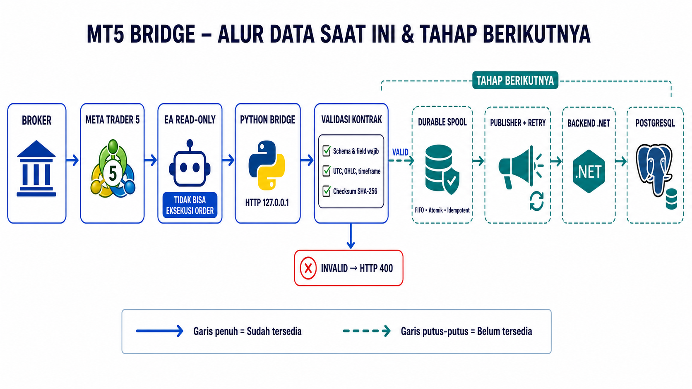
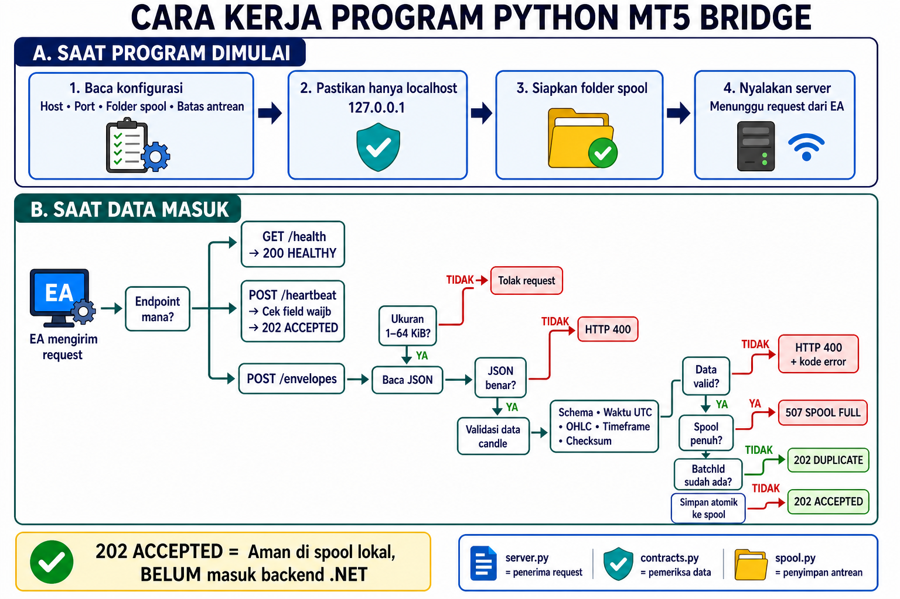

# MT5 Python Bridge

Lihat [Alur MT5 Bridge](FLOW.md) untuk diagram dan penjelasan perjalanan data dari EA sampai
durable spool, termasuk status bagian yang belum diimplementasikan.



Untuk memahami urutan kerja source Python tanpa membaca kode terlebih dahulu, lihat
[flowchart program Python](docs/python-program-flowchart.png).



Bridge ini berjalan native di Lubuntu dan hanya menerima data dari EA melalui `127.0.0.1`.
Bridge menerima heartbeat starter dan envelope candle `mt5-envelope.v1`, lalu memvalidasi
kontrak canonical dan menyimpan batch secara atomik ke durable FIFO spool sebelum memberikan
respons `202 Accepted`. Jika URL backend dan API key dikonfigurasi, proses receiver menjalankan
publisher yang mereplay spool ke endpoint ingestion .NET, menghapus item hanya setelah ACK,
melakukan retry/backoff untuk kegagalan sementara, dan mengarantina penolakan permanen.

Receiver menjawab menggunakan HTTP/1.1 agar client MT5/Wine yang memakai handshake
`Expect: 100-continue` untuk payload envelope tidak mengalami read timeout sebelum body
dikirim.

```bash
cd mt5-bridge
python3 -m venv .venv
source .venv/bin/activate
python -m pip install -e .
python -m forex_intelligence_bridge.server
```

Pada terminal kedua:

```bash
curl http://127.0.0.1:8001/health
```

EA mengirim heartbeat ke `POST /v1/mt5/heartbeat` dan batch candle versioned ke
`POST /v1/mt5/envelopes`. Batch candle dibatasi maksimal 100 record. Timestamp harus UTC,
harga dikirim sebagai decimal string, dan checksum memakai format `sha256:<64 hex>`.
Checksum dihitung dari array `records` sebagai JSON UTF-8 compact dengan key yang diurutkan.

Konfigurasi spool bersifat opsional:

```text
MT5_BRIDGE_SPOOL_PATH=spool
MT5_BRIDGE_SPOOL_MAX_ITEMS=10000
MT5_BRIDGE_SPOOL_MAX_BYTES=268435456
```

Untuk mengaktifkan replay ke endpoint ingestion .NET:

```text
MT5_BRIDGE_BACKEND_URL=http://127.0.0.1:5000/api/v1/bridge/candle-batches
MT5_BRIDGE_BACKEND_API_KEY=<secret minimal 32 byte yang sama dengan konfigurasi .NET>
MT5_BRIDGE_REPLAY_INTERVAL_SECONDS=1
```

Saat kapasitas penuh, bridge menolak batch baru dengan HTTP `507` dan tidak menghapus batch
lama secara diam-diam. File spool diberi permission `0600` dan direplay menurut sequence.

Menjalankan test:

```bash
PYTHONPATH=src python -m unittest discover -s tests
```

Menjalankan simulator untuk satu candle `EURUSD H1`, atau seluruh matriks canonical
5 instrumen x 3 timeframe:

```bash
PYTHONPATH=src python tools/mt5_simulator.py --once
PYTHONPATH=src python tools/mt5_simulator.py --matrix
```

Simulator memakai source instance yang stabil. Jika backend PostgreSQL yang sama sudah pernah
menerima sequence tersebut, lanjutkan dari sequence berikutnya agar pengiriman baru tidak dianggap
konflik, misalnya:

```bash
PYTHONPATH=src python tools/mt5_simulator.py --once --sequence-start 2
```

Menjalankan bounded local soak/load verification (500 envelope dan duplicate setiap 10
envelope, menggunakan spool sementara yang otomatis dibersihkan):

```bash
PYTHONPATH=src python tools/bridge_soak_test.py --envelopes 500 --duplicate-every 10
```

Jangan mengubah bind address receiver ke LAN/internet. Machine authentication, endpoint batch
.NET, dan integrasi publisher sudah tersedia; credential yang sama harus dipasang secara aman
pada bridge dan backend sebelum verifikasi di mesin target.
